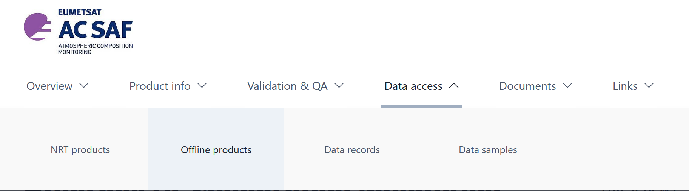
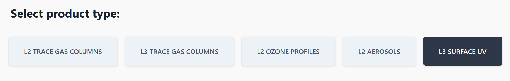
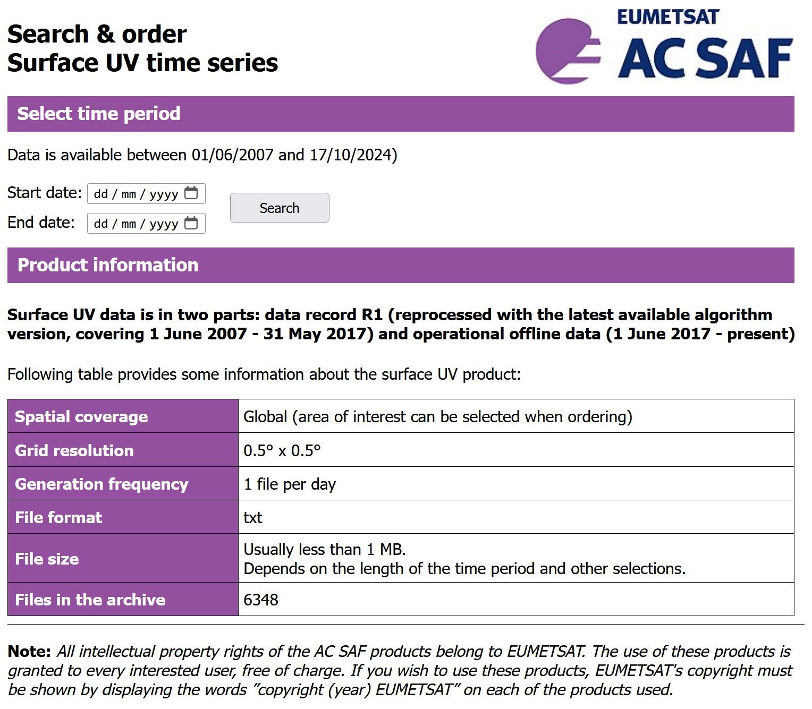
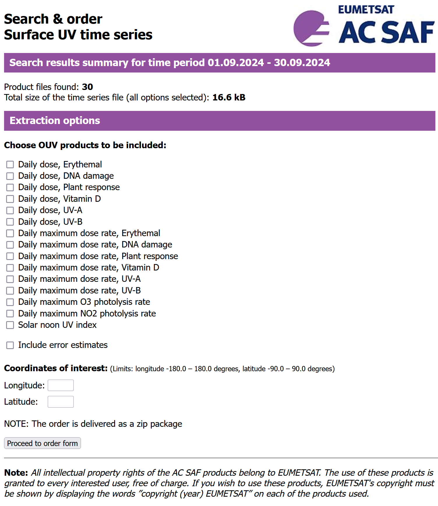
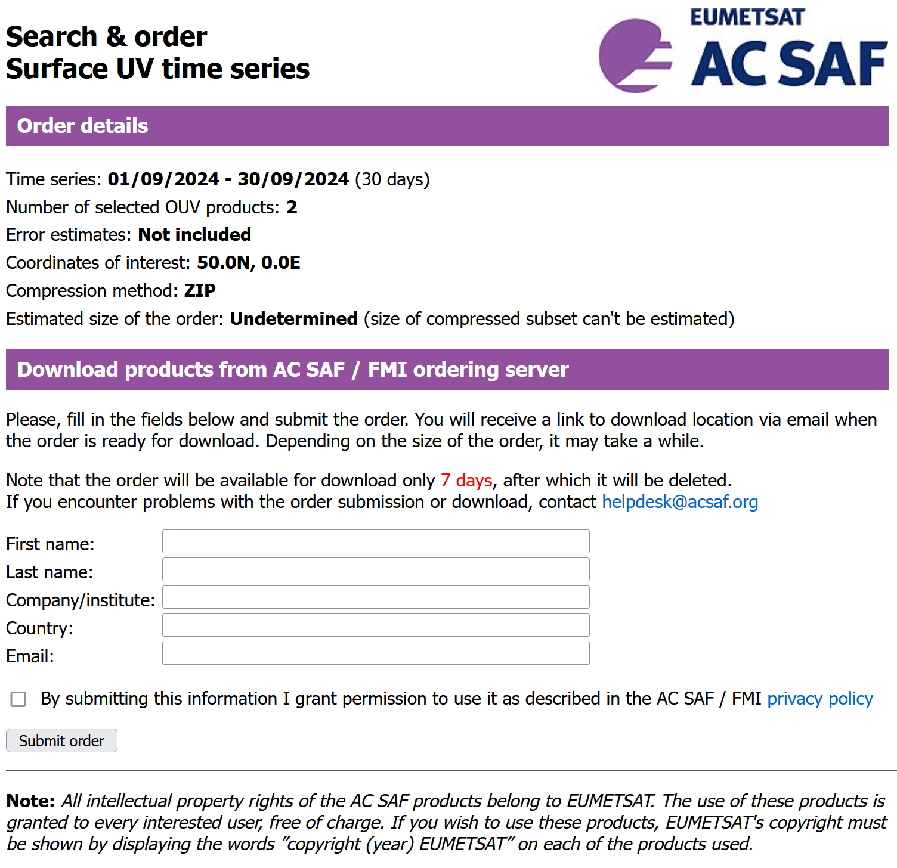
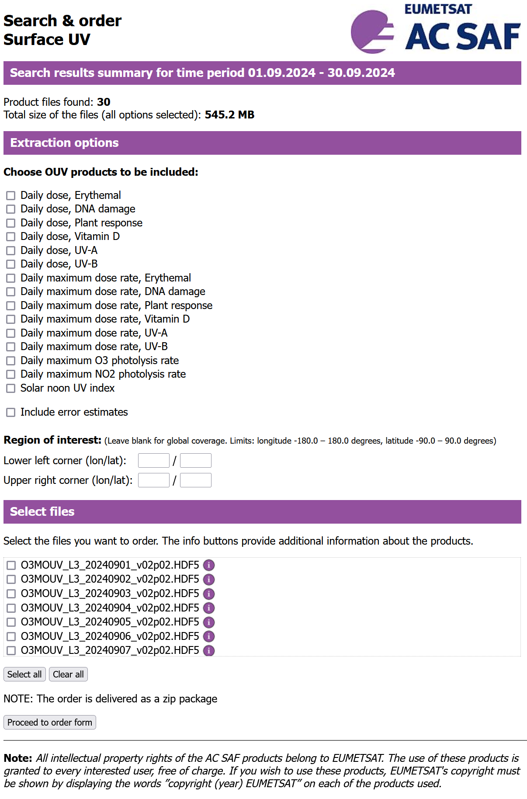

```{r, include = FALSE}
knitr::opts_chunk$set(
  fig.width = 6,
  fig.height = 4,
  out.width = "95%",
  collapse = TRUE,
  comment = "#>"
)
```

```{r setup}
library(reumetsat)
library(rhdf5)
```

## The Surface UV data product

The AC SAF project of EUMETSAT on atmospheric composition provides several different data products, including "Surface UV", for ultraviolet radiation doses and irradiances. The "Surface UV" data are on a $0.5^\circ \times 0.5^\circ$ longitude E and latitude N grid. That is to say that latitudes south of the equator and longitudes west of Greenwich are expressed as negative numbers. The data consist in several different variables, both daily doses and daily maximum irradiances, biologically weighted and not weighted, estimates of uncertainties for them as well as quality flags.

Except for the UV Index (UVI) which has no units, or more strictly, has implicit convenience units, and is expressed on a fixed scale of 0 to 20, values are all expressed in energy-based SI units, i.e., using Joules, seconds and metres. UV-A and UV-B irradiances and daily doses are expressed as pure energy units, while biologically effective doses and irradiances (BE) are expressed in spectrally weighted "energy" units (not true energy units). Biologically effective doses attempt to be proportional to the effect of UV radiation on specific biological responses in humans, plants or organisms in general.

The data are not based on surface measurements of radiation, but instead derived from remotely sensed reflected radiation, estimates of the concentration of atmospheric gases and remotely sensed cloud coverage. The raw data originate from instruments on multiple satellites. The methodology has been validated against actual UV measurements at the Earth surface (see Kujanpää, 2019).

Data can be downloaded in two different formats, suitable for different uses. The most efficient way of downloading data for a single location is to download them as a _time series_ in a text file. In contrast,  to download data for a region or the whole Earth, downloading gridded data is the right approach. Gridded data are available as binary files in HDF5 format, that allow selective reading of variables and grid regions, allowing fast "ingestion" of the data. This package provides functions that make it easy to selectively import data in either format into R data frames. To obtain the files, a request must be submitted at a web page as there is no API available. In addition, the files can be downloaded only after a delay, as they are not ready in the server but are instead created based on the details of each request. Below we give brief instructions on how to request files in each of these formats, starting with time series and later describing the differences with the download of gridded data.

## Time series data

Before submitting a request, the first step is finding the coordinates of the location of interest (Google Earth is handy for this) and deciding on the period to be covered by the data. We need to also consider which variables are useful to us and which are not, at least if we want to limit the size of the files. Each time series requested has no date gaps, as any missing data are marked as such but no rows are missing in the files.

Data can be downloaded at the [EUMETSAT AC SAF website](https://acsaf.org/). First navigate to offline data products page.



Next select the Surface UV product.



In the page that opens you will find three links, "Surface UV", "Step 1 Register" and "Step 2 Log in". "Surface UV" gives access to the documentation. "Step 1 Register" needs to be followed once to create a free account and "Step 2 Log in" should be followed each time submit a request for data files. During log-in a dialogue opens where we can choose the data product from a list of options. The functions in this package can read data corresponding to "Surface UV" and "Surface UV time-series".

The form display after selecting "Surface UV time-series" is.



The next form lists the available variables for the user to selects those needed and also included two fields to enter the geographic coordinates of the location of interest. The coordinates entered do not need to be at the centre of a tile, or exact grid point. The data for the nearest one will be returned. _Longitudes and Latitudes should be expressed so that N and E coordinates are positive numbers and S and W coordinates are negative numbers._



Finally we have to fill an order form, with simple information of the intended use of the data.



The data are prepared and some time later an e-mail is sent by the server containing a link to download a `zip`-compressed archive file.

The files are text files with a header protected with `#` as comment marker and the data are stored in aligned columns separated by one space character. The column names are not stored as column headings, but instead in the header of the file, one variable per row. Thus, decoding the file header is key to the interpretation of the data, while reading the data is simple, although setting the correct R classes to the different variables is also important. The top of a time-series text file is shown below.

```
#AC SAF offline surface UV, time-series
#OUV EXTRACTOR VERSION: 1.20
#LONGITUDE: 25.000 (0-based index 410)
#LATITUDE: 60.000 (0-based index 300)
#COLUMN DEFINITIONS
#0: Date [YYYYMMDD]
#1: DailyDoseUva [kJ/m2]
#2: DailyDoseUvb [kJ/m2]
#3: DailyMaxDoseRateUva [mW/m2]
#4: DailyMaxDoseRateUvb [mW/m2]
#5: QC_MISSING
#6: QC_LOW_QUALITY
#7: QC_MEDIUM_QUALITY
#8: QC_INHOMOG_SURFACE
#9: QC_POLAR_NIGHT
#10: QC_LOW_SUN
#11: QC_OUTOFRANGE_INPUT
#12: QC_NO_CLOUD_DATA
#13: QC_POOR_DIURNAL_CLOUDS
#14: QC_THICK_CLOUDS
#15: QC_ALB_CLIM_IN_DYN_REG
#16: QC_LUT_OVERFLOW
#17: QC_OZONE_SOURCE
#18: QC_NUM_AM_COT
#19: QC_NUM_PM_COT
#20: QC_NOON_TO_COT
#21: Algorithm version
#DATA
20240501  1.224e+03  1.558e+01  3.932e+04  6.628e+02 0 0 0 0 0 0 0 0 0 0 0 0  1  2  0  0 2.2
20240502  1.235e+03  1.648e+01  3.951e+04  6.974e+02 0 0 0 0 0 0 0 0 0 0 0 0  1  2  0  0 2.2
20240503  9.368e+02  1.345e+01  3.224e+04  5.871e+02 0 0 0 0 0 0 0 0 0 0 0 0  1  2  0  0 2.2
... etc.
```

## Data on a geographic grid

Worldwide coverage consists in $720 \times 360 = `r 720 * 360`$ grid points. As for time series, the number of data columns varies depending of what was included in the request when the file was downloaded. However, one difference is that QC information is collected into a single variable as a 64 bit integer number. The format of the files is HDF5. These are special binary files that allow selective reading. There are additional optimizations used to reduce the size, the main one is that the geographic coordinates of the grid points are not saved explicitly but instead the information needed to compute them is included as metadata. The data are provided as one file per day, with the size of the files depending on the number of grid points included as well as the number of variables. As these are off-line data available with a delay, in most cases we are interested in data for a certain period of time rather than for a single day.

### Obtaining the files

Before submitting a request, the first step is finding the latitudes and longitudes enclosing the region of interest and deciding on the period to be covered by the data. We need to also consider which variables are useful to us and which are not, at least if we want to limit the size of the files. Follow the instructions given above for "Surface UV time-series", but select instead "Surface UV" in the login-form.

The next form makes it possible to select variables, files (= days) and the enclosing geographic coordinates of the area of interest. When selecting files, unless you select all of them, make sure to scroll the list of file names to see all of them. The file names contain the date as a sequence of eight digits YYYYMMDD.



The data are prepared and some time later an e-mail is sent by the server containing a link to download a `zip`.compressed archive file. This `.zip` file contains one HDF5 file for selected each day in the time period. As these files are binary, we can explore their contents using special functions from R packages 'rhdf5' and 'reumetsat'. From its contents we see that it includes only some of the variables available for download.

```{r, include=FALSE}
one.file.name <-
   system.file("extdata", "O3MOUV_L3_20240621_v02p02.HDF5",
               package = "reumetsat", mustWork = TRUE)
```

```{r, echo=FALSE}
rhdf5::h5ls(one.file.name)
```
The file used as an example is for an area that includes the Iberian peninsula, i.e., Spain and Portugal. Thus, it is also contains only a small subset of the grid points available for download ($`r 13 * 17`$ out of $`r 720 * 360`$).

```{r, echo=FALSE}
grid_AC_SAF_UV_hdf5(one.file.name)
```

The User Guide and other documentation of package 'reumetsat' show how to import the data into R's data frames.

## References

Kujanpää, J. (2019) _PRODUCT USER MANUAL Offline UV Products v2
   (IDs: O3M-450 - O3M-464) and Data Record R1 (IDs: O3M-138 - O3M-152)_. Ref.
   SAF/AC/FMI/PUM/001. 18 pp. EUMETSAT AC SAF.

